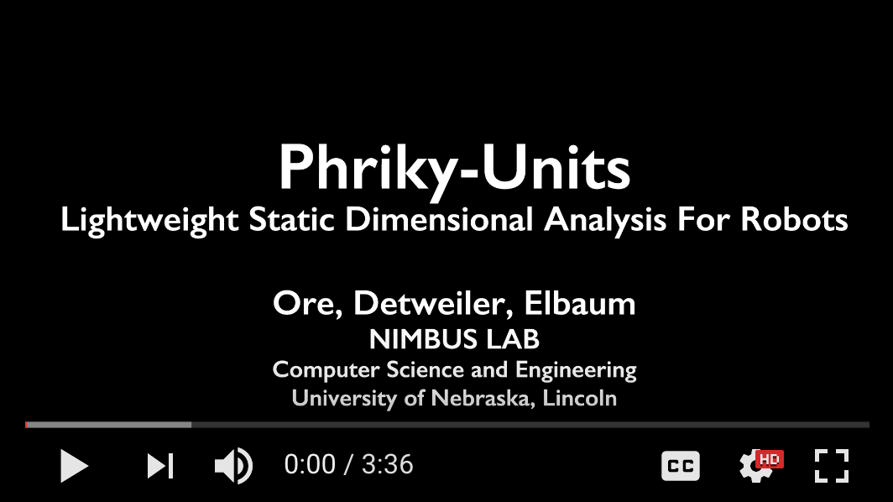

## Phriky Units - Physical Unit Inconsistency Detection

Physical unit static analysis tool for C++, especially for ROS, pronounced *‘freaky’* for the Greek work Phriki meaning ‘horror’.

\* Free software: MIT license .. \*Lightweight static analysis Lightweight static analysis 

## Install (tested on Ubuntu 16.04 and OSX 10.11.6)

`sudo pip install phriky_units`

**Requires Cppcheck &gt; 1.75:**

`sudo apt-get install cppcheck` (Ubuntu 16.04)

`brew install cppcheck` (OSX)

`git clone git://github.com/danmar/cppcheck.git` (Ubuntu 14.04)

Examples:
=========

You can run examples by checking out:

`git clone https://github.com/unl-nimbus-lab/phriky-units.git`

Then from that directory run:

`phriky_units ./examples/addition/src/action.cpp`

`phriky_units ./examples/assignment/src/trajectory_planner_ros.cpp`

`phriky_units ./examples/comparison/src/twist_marker.cpp`

Features
========

-   Detects physical unit inconsistencies, like adding quantities with different units, i.e. `meters` + `seconds`.
-   Lightweight static analysis
-   Path insensitive
-   No annotation burden
-   Low false positive rate (&lt; 15% for \`high-confidence’ inconsistencies)
-   Works with [ROS]

Credits
=======

[NIMBUS] Lab at the University of Nebraska, Lincoln

This work was supported in part by NSF awards \#1638099 and \#1526652, and USDA-NIFA \#2013-67021-20947.

  [ROS]: http://www.ros.org
  [NIMBUS]: http://nimbus.unl.edu
